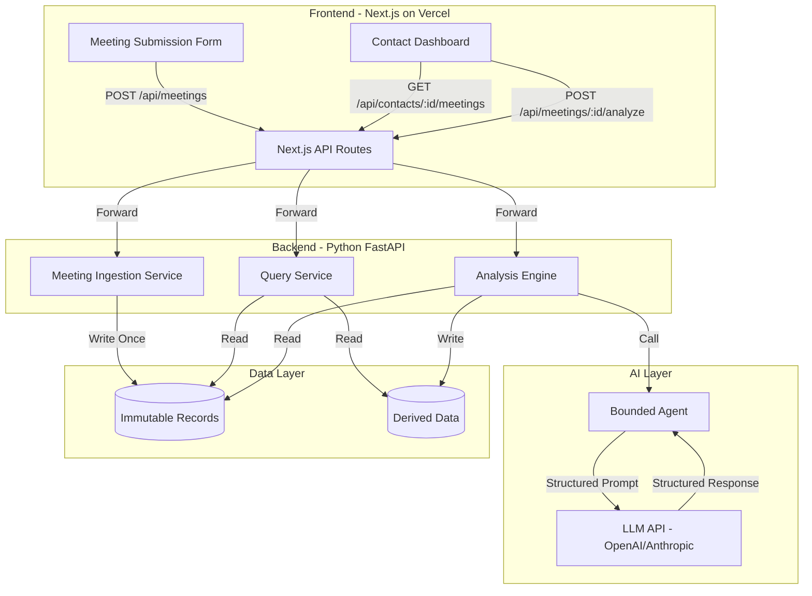

# Design Document: TruthOS Meeting Intelligence

## Overview

TruthOS Meeting Intelligence is a full-stack application that implements a contact-centric meeting analysis system with strict separation between immutable operational records and derived analytical data. The system consists of:

- **Frontend**: Next.js 14+ (App Router) with TypeScript, deployed on Vercel
- **Backend**: Python FastAPI service, deployed as Vercel Serverless Functions
- **AI Layer**: LLM-powered bounded agents for structured analysis
- **Data Layer**: Contact-centric relational database with immutability guarantees

The architecture follows a clear data flow: Meeting Ingestion → Immutable Storage → LLM Analysis → Derived Data Storage → Dashboard Display.

## Architecture

### High-Level Architecture Diagram



### Service Responsibilities

**Frontend (Next.js)**
- Meeting submission form with validation
- Contact dashboard with meeting history
- Analysis results visualization
- API route handlers that proxy to backend
- Authentication state management

**Backend (FastAPI)**
- Meeting ingestion with validation
- Meeting analysis orchestration
- Contact query endpoints
- Database operations
- RBAC enforcement

**AI Layer**
- Bounded agent with structured prompts
- Schema-validated LLM responses
- Retry logic for API failures
- Cost tracking and rate limiting

**Data Layer**
- Immutable meeting records (append-only)
- Derived analysis records (regenerable)
- Contact-centric indexing
- Referential integrity enforcement

## Components and Interfaces

### Frontend Components

#### MeetingSubmissionForm Component
```typescript
interface MeetingSubmissionFormProps {
  onSuccess: (meeting: Meeting) => void;
  onError: (error: string) => void;
}

interface MeetingFormData {
  contactId: string;
  type: 'sales' | 'coaching';
  occurredAt: string; // ISO 8601
  transcript: string;
}
```

**Responsibilities:**
- Render form fields with validation
- Handle form submission
- Display loading and error states
- Clear form on success

#### ContactDashboard Component
```typescript
interface ContactDashboardProps {
  contactId: string;
}

interface Meeting {
  id: string;
  contactId: string;
  type: 'sales' | 'coaching';
  occurredAt: string;
  transcript: string;
  createdAt: string;
}

interface MeetingAnalysis {
  id: string;
  meetingId: string;
  sentiment: 'positive' | 'neutral' | 'negative';
  topics: string[];
  objections: string[];
  commitments: string[];
  outcome: 'closed' | 'follow_up' | 'no_interest' | 'unknown';
  summary: string;
  analyzedAt: string;
}
```

**Responsibilities:**
- Fetch and display meeting list
- Expandable meeting details
- Trigger analysis requests
- Visual separation of immutable vs derived data
- Mobile-responsive layout

### Backend Services

#### Meeting Ingestion Service
```python
class MeetingIngestionService:
    def create_meeting(self, data: MeetingCreate) -> Meeting:
        """
        Validates and persists meeting as immutable record.
        
        Args:
            data: Meeting creation data
            
        Returns:
            Created meeting with assigned ID
            
        Raises:
            ValidationError: If data is invalid
        """
        pass

class MeetingCreate(BaseModel):
    meetingId: str
    contactId: str
    type: Literal['sales', 'coaching']
    occurredAt: datetime
    transcript: str
```

#### Analysis Engine
```python
class AnalysisEngine:
    def analyze_meeting(self, meeting_id: str) -> MeetingAnalysis:
        """
        Analyzes meeting transcript using bounded LLM agent.
        
        Args:
            meeting_id: ID of meeting to analyze
            
        Returns:
            Structured analysis results
            
        Raises:
            MeetingNotFoundError: If meeting doesn't exist
            AnalysisError: If LLM analysis fails
        """
        pass

class BoundedAgent:
    def extract_signals(self, transcript: str) -> AnalysisSignals:
        """
        Extracts structured signals from transcript using LLM.
        
        Uses structured prompt with JSON schema enforcement.
        Implements retry logic and validation.
        
        Args:
            transcript: Meeting transcript text
            
        Returns:
            Validated structured signals
        """
        pass

class AnalysisSignals(BaseModel):
    sentiment: Literal['positive', 'neutral', 'negative']
    topics: List[str]
    objections: List[str]
    commitments: List[str]
    outcome: Literal['closed', 'follow_up', 'no_interest', 'unknown']
    summary: str
```

#### Query Service
```python
class QueryService:
    def get_contact_meetings(
        self, 
        contact_id: str, 
        include_analysis: bool = True
    ) -> List[MeetingWithAnalysis]:
        """
        Retrieves all meetings for a contact with optional analysis.
        
        Args:
            contact_id: Contact identifier
            include_analysis: Whether to join analysis data
            
        Returns:
            List of meetings ordered by occurredAt descending
        """
        pass
```

### API Endpoints

#### POST /api/meetings
**Request:**
```json
{
  "meetingId": "meet_abc123",
  "contactId": "contact_xyz789",
  "type": "sales",
  "occurredAt": "2024-01-15T14:30:00Z",
  "transcript": "Full meeting transcript text..."
}
```

**Response (201):**
```json
{
  "id": "meet_abc123",
  "contactId": "contact_xyz789",
  "type": "sales",
  "occurredAt": "2024-01-15T14:30:00Z",
  "transcript": "Full meeting transcript text...",
  "createdAt": "2024-01-15T14:35:00Z"
}
```

#### POST /api/meetings/{meetingId}/analyze
**Request:** Empty body

**Response (200):**
```json
{
  "id": "analysis_def456",
  "meetingId": "meet_abc123",
  "sentiment": "positive",
  "topics": ["pricing", "implementation timeline", "integration"],
  "objections": ["budget concerns", "timeline constraints"],
  "commitments": ["follow up next week", "send proposal"],
  "outcome": "follow_up",
  "summary": "Positive discussion about product fit...",
  "analyzedAt": "2024-01-15T14:40:00Z"
}
```

#### GET /api/contacts/{contactId}/meetings
**Response (200):**
```json
{
  "contactId": "contact_xyz789",
  "meetings": [
    {
      "id": "meet_abc123",
      "type": "sales",
      "occurredAt": "2024-01-15T14:30:00Z",
      "transcript": "Full transcript...",
      "createdAt": "2024-01-15T14:35:00Z",
      "analysis": {
        "sentiment": "positive",
        "topics": ["pricing", "implementation timeline"],
        "outcome": "follow_up",
        "summary": "Positive discussion...",
        "analyzedAt": "2024-01-15T14:40:00Z"
      }
    }
  ]
}
```

## Data Models

### Database Schema

```sql
-- Immutable Records Table
CREATE TABLE meetings (
    id VARCHAR(255) PRIMARY KEY,
    contact_id VARCHAR(255) NOT NULL,
    type VARCHAR(20) NOT NULL CHECK (type IN ('sales', 'coaching')),
    occurred_at TIMESTAMP NOT NULL,
    transcript TEXT NOT NULL,
    created_at TIMESTAMP NOT NULL DEFAULT CURRENT_TIMESTAMP,
    
    INDEX idx_contact_occurred (contact_id, occurred_at DESC)
);

-- Prevent updates and deletes on immutable records
CREATE TRIGGER prevent_meeting_update
    BEFORE UPDATE ON meetings
    FOR EACH ROW
    SIGNAL SQLSTATE '45000'
    SET MESSAGE_TEXT = 'Meetings are immutable and cannot be updated';

CREATE TRIGGER prevent_meeting_delete
    BEFORE DELETE ON meetings
    FOR EACH ROW
    SIGNAL SQLSTATE '45000'
    SET MESSAGE_TEXT = 'Meetings are immutable and cannot be deleted';

-- Derived Data Table
CREATE TABLE meeting_analyses (
    id VARCHAR(255) PRIMARY KEY,
    meeting_id VARCHAR(255) NOT NULL,
    sentiment VARCHAR(20) NOT NULL CHECK (sentiment IN ('positive', 'neutral', 'negative')),
    topics JSON NOT NULL,
    objections JSON NOT NULL,
    commitments JSON NOT NULL,
    outcome VARCHAR(20) NOT NULL CHECK (outcome IN ('closed', 'follow_up', 'no_interest', 'unknown')),
    summary TEXT NOT NULL,
    analyzed_at TIMESTAMP NOT NULL DEFAULT CURRENT_TIMESTAMP,
    
    FOREIGN KEY (meeting_id) REFERENCES meetings(id),
    INDEX idx_meeting (meeting_id, analyzed_at DESC)
);

-- Contacts table (simplified for assessment)
CREATE TABLE contacts (
    id VARCHAR(255) PRIMARY KEY,
    name VARCHAR(255),
    created_at TIMESTAMP NOT NULL DEFAULT CURRENT_TIMESTAMP
);
```

### Data Model Principles

1. **Immutability**: Meeting records cannot be modified after creation
2. **Contact-Centric**: All data organized by contactId
3. **Separation**: Immutable truth (meetings) separate from derived data (analyses)
4. **Regenerability**: Analyses can be regenerated without affecting source records
5. **Auditability**: All records include creation timestamps

## Correctness Properties

*A property is a characteristic or behavior that should hold true across all valid executions of a system—essentially, a formal statement about what the system should do. Properties serve as the bridge between human-readable specifications and machine-verifiable correctness guarantees.*


### Property 1: Meeting Creation Round Trip

*For any* valid meeting submission with all required fields (meetingId, contactId, type, occurredAt, transcript), creating the meeting should persist it to the database and return a record containing all submitted fields plus a createdAt timestamp, and retrieving the meeting by ID should return the same data.

**Validates: Requirements 1.2, 1.4, 1.6, 5.1, 7.3**

### Property 2: Invalid Meeting Rejection

*For any* meeting submission missing required fields or with invalid type values (not "sales" or "coaching"), the Meeting_Ingestion_API should reject the submission and return a descriptive error response without persisting any data.

**Validates: Requirements 1.2, 1.3, 1.5**

### Property 3: Meeting Immutability

*For any* meeting record that has been successfully created, any attempt to update or delete the record should fail with an error, ensuring the immutability of operational records.

**Validates: Requirements 5.2, 7.1, 7.2**

### Property 4: Analysis Creation Round Trip

*For any* valid meeting ID, requesting analysis should extract structured signals (sentiment, topics, objections, commitments, outcome, summary) conforming to the predefined schema, persist the analysis with an analyzedAt timestamp, and retrieving the analysis should return the same structured data.

**Validates: Requirements 3.3, 3.4, 3.5, 5.3, 7.4**

### Property 5: Analysis Retrieval Correctness

*For any* meeting ID with an existing transcript, requesting analysis should retrieve the correct transcript from immutable records and base the analysis on that specific transcript content.

**Validates: Requirements 3.2**

### Property 6: Derived Data Separation

*For any* meeting analysis operation, the analysis results should be stored in a separate table from meeting records, and creating or regenerating analysis should never modify the immutable meeting record.

**Validates: Requirements 3.6, 5.4**

### Property 7: Analysis Error Handling

*For any* analysis request that fails (due to LLM errors, invalid meeting ID, etc.), the system should return a descriptive error response without creating partial analysis records or modifying any existing records.

**Validates: Requirements 3.7**

### Property 8: Contact Meeting Query Correctness

*For any* contact ID, querying meetings should return all and only the meetings associated with that contact, ordered by occurredAt in descending order (most recent first).

**Validates: Requirements 4.2, 5.6**

### Property 9: Meeting Display Completeness

*For any* meeting record, the dashboard display should include all required fields (meetingId, type, occurredAt, transcript preview), and the expandable view should show the full transcript.

**Validates: Requirements 4.3, 4.4**

### Property 10: Analysis Display Conditional

*For any* meeting that has associated analysis data, the dashboard expandable view should display all analysis fields (sentiment, topics, objections, commitments, outcome, summary), and for meetings without analysis, no analysis section should be displayed.

**Validates: Requirements 4.5**

### Property 11: UI Loading and Error States

*For any* async operation (form submission, data loading), the UI should display loading indicators during the operation, and if an error occurs, should display an error message to the user.

**Validates: Requirements 2.6, 4.8, 4.9**

### Property 12: Form Submission Success Handling

*For any* valid form submission that succeeds, the UI should display a confirmation message, clear all form fields, and trigger a POST request to the Meeting_Ingestion_API with the form data.

**Validates: Requirements 2.3, 2.4**

### Property 13: Form Submission Error Handling

*For any* form submission that returns an error from the API, the UI should display the error message to the user without clearing the form fields.

**Validates: Requirements 2.5**

### Property 14: Referential Integrity

*For any* meeting analysis record, the referenced meeting ID must exist in the meetings table, and attempting to create an analysis for a non-existent meeting should fail with an error.

**Validates: Requirements 5.5**

### Property 15: Multiple Analyses Support

*For any* meeting record, the system should allow creating multiple analysis records (to support re-analysis), and each analysis should be independently stored with its own analyzedAt timestamp.

**Validates: Requirements 7.5**

### Property 16: Operator Analysis Authorization

*For any* user with Operator role, requests to analyze meetings should be authorized and processed successfully.

**Validates: Requirements 6.2**

### Property 17: Basic User Analysis Restriction

*For any* user with Basic_User role, requests to analyze meetings should be denied with an authorization error.

**Validates: Requirements 6.3**

### Property 18: Authenticated User Read Access

*For any* authenticated user (regardless of role), requests to view meetings and analysis results should be authorized and processed successfully.

**Validates: Requirements 6.4**

## Error Handling

### Error Categories

**Validation Errors (400)**
- Missing required fields
- Invalid field values (e.g., type not in ['sales', 'coaching'])
- Invalid date formats
- Empty transcript

**Authorization Errors (403)**
- Basic user attempting to trigger analysis
- Unauthenticated user accessing protected endpoints

**Not Found Errors (404)**
- Meeting ID does not exist
- Contact ID has no meetings

**LLM Errors (500)**
- LLM API timeout or rate limit
- LLM response doesn't match schema
- LLM API authentication failure

**Database Errors (500)**
- Connection failures
- Constraint violations
- Immutability violations (attempted update/delete)

### Error Response Format

All errors follow a consistent format:

```json
{
  "error": {
    "code": "VALIDATION_ERROR",
    "message": "Missing required field: contactId",
    "details": {
      "field": "contactId",
      "constraint": "required"
    }
  }
}
```

### Retry and Fallback Strategy

**LLM Analysis Retries:**
- Retry up to 3 times with exponential backoff
- If all retries fail, return error without persisting partial data
- Log failures for monitoring

**Database Retries:**
- Retry transient connection errors up to 2 times
- Do not retry constraint violations or immutability violations
- Use connection pooling to minimize connection errors

## Testing Strategy

### Dual Testing Approach

The system requires both unit tests and property-based tests for comprehensive coverage:

**Unit Tests** focus on:
- Specific examples demonstrating correct behavior
- Edge cases (empty transcripts, special characters, boundary dates)
- Error conditions (missing fields, invalid types, non-existent IDs)
- Integration points (API endpoint responses, database connections)

**Property-Based Tests** focus on:
- Universal properties that hold for all inputs
- Comprehensive input coverage through randomization
- Invariants (immutability, referential integrity)
- Round-trip properties (create → retrieve, serialize → deserialize)

### Property-Based Testing Configuration

**Library Selection:**
- **Python Backend**: Use `hypothesis` library for property-based testing
- **TypeScript Frontend**: Use `fast-check` library for property-based testing

**Test Configuration:**
- Minimum 100 iterations per property test (due to randomization)
- Each property test must reference its design document property
- Tag format: `# Feature: truthos-meeting-intelligence, Property {number}: {property_text}`

**Property Test Implementation:**
- Each correctness property MUST be implemented by a SINGLE property-based test
- Tests should generate random valid and invalid inputs
- Tests should verify invariants hold across all generated inputs

### Example Property Test Structure

```python
# Python backend example using hypothesis
from hypothesis import given, strategies as st

@given(
    meeting_id=st.text(min_size=1),
    contact_id=st.text(min_size=1),
    meeting_type=st.sampled_from(['sales', 'coaching']),
    transcript=st.text(min_size=1)
)
def test_meeting_creation_round_trip(meeting_id, contact_id, meeting_type, transcript):
    """
    Feature: truthos-meeting-intelligence, Property 1: Meeting Creation Round Trip
    
    For any valid meeting submission, creating and retrieving should return the same data.
    """
    # Create meeting
    created = create_meeting({
        'meetingId': meeting_id,
        'contactId': contact_id,
        'type': meeting_type,
        'transcript': transcript
    })
    
    # Retrieve meeting
    retrieved = get_meeting(created['id'])
    
    # Verify all fields match
    assert retrieved['meetingId'] == meeting_id
    assert retrieved['contactId'] == contact_id
    assert retrieved['type'] == meeting_type
    assert retrieved['transcript'] == transcript
    assert 'createdAt' in retrieved
```

### Test Coverage Requirements

**Backend Tests:**
- Unit test for meeting ingestion validation
- Unit test for analysis engine LLM integration
- Property test for meeting immutability
- Property test for analysis round trip
- Property test for RBAC authorization

**Frontend Tests:**
- Component test for meeting submission form rendering
- Component test for meeting list display
- Property test for form submission handling
- Property test for loading and error states

## Engineering Reasoning

### Preventing Retroactive Data Manipulation

**Immutability Enforcement:**
- Database triggers prevent UPDATE and DELETE operations on meetings table
- Application layer validates that meeting records are never modified
- Audit trail via createdAt timestamps on all records
- Derived data (analyses) stored separately and can be regenerated

**Benefits:**
- Compliance and auditability: complete history of operational activity
- Trust: users cannot manipulate past records to change outcomes
- Debugging: original data always available for investigation
- Reproducibility: analyses can be re-run on original transcripts

**Trade-offs:**
- Storage grows continuously (no deletion)
- Corrections require new records with annotations
- Requires clear communication to users about immutability

### Constraining LLM to Prevent Hallucinations

**Bounded Agent Design:**
- Structured prompts with explicit JSON schema requirements
- Schema validation on LLM responses (reject invalid outputs)
- Constrained output format (enums for sentiment/outcome)
- No free-form chat or open-ended generation

**Implementation:**
```python
ANALYSIS_PROMPT = """
Analyze the following meeting transcript and extract structured information.

You must respond with valid JSON matching this exact schema:
{
  "sentiment": "positive" | "neutral" | "negative",
  "topics": ["topic1", "topic2", ...],
  "objections": ["objection1", ...],
  "commitments": ["commitment1", ...],
  "outcome": "closed" | "follow_up" | "no_interest" | "unknown",
  "summary": "brief summary"
}

Transcript:
{transcript}

Respond only with valid JSON, no additional text.
"""
```

**Validation:**
- Parse response as JSON (fail if invalid)
- Validate against Pydantic schema (fail if fields missing/wrong type)
- Retry with clearer instructions if validation fails
- Log failures for monitoring and improvement

**Benefits:**
- Predictable, structured outputs
- Easy to validate and test
- Reduced hallucination risk (constrained output space)
- Cost-effective (shorter, focused prompts)

**Trade-offs:**
- Less flexible than free-form analysis
- May miss nuanced insights
- Requires careful prompt engineering

### Scalability Considerations at 10× Usage

**Current Architecture Bottlenecks:**

1. **LLM API Calls (Primary Bottleneck)**
   - Current: Synchronous analysis per meeting
   - At 10×: Rate limits, increased latency, high costs
   - Solution: Async job queue (Celery/Redis), batch processing, caching

2. **Database Queries**
   - Current: Simple queries with indexes on contactId
   - At 10×: Slow queries on large tables, connection pool exhaustion
   - Solution: Read replicas, query optimization, connection pooling, pagination

3. **Frontend Rendering**
   - Current: Client-side rendering of meeting lists
   - At 10×: Large lists cause slow rendering
   - Solution: Virtual scrolling, pagination, server-side rendering

**Scaling Strategy:**

**Phase 1 (Current → 3×):**
- Add database indexes on frequently queried fields
- Implement connection pooling
- Add pagination to meeting lists
- Cache analysis results in Redis

**Phase 2 (3× → 10×):**
- Move LLM analysis to async job queue
- Add database read replicas
- Implement rate limiting on API endpoints
- Add monitoring and alerting

**Phase 3 (10× → 100×):**
- Shard database by contactId
- Implement CDN for frontend assets
- Add horizontal scaling for backend services
- Consider dedicated LLM inference infrastructure

**Cost Awareness:**
- Track LLM API costs per analysis
- Implement analysis caching (don't re-analyze unchanged transcripts)
- Rate limit analysis requests per user
- Consider cheaper models for initial classification, expensive models for detailed analysis

### Anonymizing and Publishing Outcome Metrics

**Anonymization Strategy:**

1. **Aggregate Metrics Only**
   - Publish only aggregated statistics (e.g., "30% of sales meetings resulted in closed deals")
   - Never publish individual meeting data or contact-specific metrics

2. **K-Anonymity**
   - Ensure each published metric represents at least K contacts (e.g., K=10)
   - Suppress metrics for small cohorts

3. **Differential Privacy**
   - Add calibrated noise to aggregate metrics
   - Prevents reverse-engineering individual records from aggregates

4. **Field Removal**
   - Remove all PII fields (names, emails, phone numbers) from transcripts before analysis
   - Use pseudonymous IDs (contactId) that cannot be linked to real identities

**Publishing Pipeline:**

```python
def publish_outcome_metrics(start_date, end_date):
    """
    Publishes anonymized outcome metrics for a date range.
    """
    # Aggregate by outcome type
    outcomes = db.query("""
        SELECT 
            outcome,
            COUNT(*) as count,
            AVG(sentiment_score) as avg_sentiment
        FROM meeting_analyses
        WHERE analyzed_at BETWEEN %s AND %s
        GROUP BY outcome
        HAVING COUNT(*) >= 10  -- K-anonymity threshold
    """, (start_date, end_date))
    
    # Add differential privacy noise
    for outcome in outcomes:
        outcome['count'] += random.gauss(0, 2)  # Laplace noise
        outcome['avg_sentiment'] += random.gauss(0, 0.1)
    
    return outcomes
```

**Benefits:**
- Enables data-driven insights without compromising privacy
- Builds trust with users (transparent about data usage)
- Complies with privacy regulations (GDPR, CCPA)

**Trade-offs:**
- Reduced accuracy due to noise and aggregation
- Cannot publish fine-grained metrics
- Requires careful threshold tuning

## Deployment Architecture

### Frontend Deployment (Vercel)

```
Next.js App (App Router)
├── app/
│   ├── api/
│   │   ├── meetings/route.ts          # Proxy to backend
│   │   ├── meetings/[id]/analyze/route.ts
│   │   └── contacts/[id]/meetings/route.ts
│   ├── contacts/[id]/page.tsx         # Contact dashboard
│   └── meetings/new/page.tsx          # Meeting submission form
├── components/
│   ├── MeetingSubmissionForm.tsx
│   ├── MeetingList.tsx
│   └── MeetingAnalysis.tsx
└── lib/
    ├── api-client.ts                  # Backend API client
    └── auth.ts                        # Auth helpers
```

**Environment Variables:**
- `NEXT_PUBLIC_API_URL`: Backend API base URL
- `JWT_SECRET`: Secret for JWT validation

### Backend Deployment (Vercel Serverless Functions or External Service)

**Option 1: Vercel Serverless Functions**
```
api/
├── meetings.py                        # POST /api/meetings
├── analyze.py                         # POST /api/meetings/{id}/analyze
└── contacts.py                        # GET /api/contacts/{id}/meetings
```

**Option 2: External Service (FastAPI)**
```
app/
├── main.py                            # FastAPI app
├── routers/
│   ├── meetings.py
│   ├── analysis.py
│   └── contacts.py
├── services/
│   ├── ingestion.py
│   ├── analysis_engine.py
│   └── query.py
├── models/
│   ├── meeting.py
│   └── analysis.py
└── db/
    ├── database.py
    └── migrations/
```

**Environment Variables:**
- `DATABASE_URL`: PostgreSQL connection string
- `LLM_API_KEY`: OpenAI/Anthropic API key
- `LLM_MODEL`: Model name (e.g., "gpt-4", "claude-3-sonnet")
- `JWT_SECRET`: Secret for JWT validation

### Database Setup

**PostgreSQL (Recommended for Production)**
- Managed service: Vercel Postgres, Supabase, or AWS RDS
- Connection pooling via PgBouncer
- Automated backups and point-in-time recovery

**SQLite (Acceptable for Assessment)**
- File-based database for simplicity
- No external dependencies
- Sufficient for demo purposes

## Cost Awareness

### LLM API Costs

**Estimated Costs per Analysis:**
- GPT-4: ~$0.03 per meeting (assuming 1000 token transcript)
- GPT-3.5-turbo: ~$0.002 per meeting
- Claude-3-Sonnet: ~$0.015 per meeting

**Cost Optimization:**
- Cache analysis results (don't re-analyze unchanged transcripts)
- Use cheaper models for initial classification
- Implement rate limiting per user
- Batch process analyses during off-peak hours

**Monitoring:**
- Track API costs per request
- Alert on unusual spending patterns
- Dashboard showing cost per contact/meeting

### Infrastructure Costs

**Vercel:**
- Free tier: 100GB bandwidth, 100 serverless function invocations/day
- Pro tier: $20/month for higher limits
- Estimated cost at 10× usage: ~$50-100/month

**Database:**
- Vercel Postgres: $0.10/GB storage + $0.10/GB transfer
- Estimated cost at 10× usage: ~$20-50/month

**Total Estimated Monthly Cost at 10× Usage: $70-150/month**

## Architecture Decision Records

### ADR 1: Contact-Centric Data Model

**Decision:** Organize all data by contactId as the primary dimension.

**Rationale:**
- Aligns with business model (understanding contact interactions)
- Simplifies queries (most queries filter by contact)
- Enables contact-level analytics and insights

**Alternatives Considered:**
- Meeting-centric model: Would require complex joins for contact views
- Time-series model: Would complicate contact-level queries

### ADR 2: Immutable Records with Separate Derived Data

**Decision:** Store meeting transcripts as immutable records, store analyses separately.

**Rationale:**
- Auditability: Original data never changes
- Reproducibility: Can re-run analyses on original data
- Trust: Users cannot manipulate historical records

**Alternatives Considered:**
- Mutable records with version history: More complex, harder to guarantee immutability
- Combined records: Would mix truth with derived data, violating single source of truth principle

### ADR 3: Bounded Agent vs Free-Form LLM

**Decision:** Use bounded agent with structured prompts and schema validation.

**Rationale:**
- Predictable outputs enable reliable downstream processing
- Reduced hallucination risk
- Easier to test and validate
- Cost-effective (focused prompts)

**Alternatives Considered:**
- Free-form chat: More flexible but unpredictable, higher hallucination risk
- Rule-based extraction: More reliable but less capable, requires extensive rules

### ADR 4: Vercel Deployment

**Decision:** Deploy frontend on Vercel, backend as Vercel Serverless Functions or external service.

**Rationale:**
- Simplified deployment (git push to deploy)
- Automatic scaling
- Good developer experience
- Cost-effective for assessment scope

**Alternatives Considered:**
- AWS Lambda + API Gateway: More complex setup, similar capabilities
- Traditional server: Requires manual scaling, higher operational overhead
